# Edu-Herbal Clinic - Database Specification (`db.md`)

## 1. Database Overview

- **DBMS**: PostgreSQL 15+
- **ORM**: Prisma ORM / Sequelize
- **Standard**: Timezone in `UTC` (`TIMESTAMPTZ`), localized to Ghana GMT (`UTC+0`). Currency in `GHS`.

---

## 2. Entity Relationship Diagram (ERD)

```mermaid
erDiagram
    STAFF_ACCOUNT ||--o{ CALL_LOG : "manages"
    STAFF_ACCOUNT ||--o{ CHAT_MESSAGE : "replies"
    STAFF_ACCOUNT ||--o{ MONTHLY_REPORT : "generates"
    
    PATIENT ||--o{ APPOINTMENT : "books"
    PATIENT ||--o{ ORDER : "places"
    PATIENT ||--o{ PAYMENT : "makes"
    PATIENT ||--o{ CALL_LOG : "contacted"
    
    DOCTOR ||--o{ APPOINTMENT : "assigned"
    
    PRODUCT ||--|| INVENTORY : "tracks"
    PRODUCT ||--o{ ORDER_ITEM : "ordered"
    
    ORDER ||--|{ ORDER_ITEM : "contains"
    ORDER ||--o| PAYMENT : "settled"
    
    CHAT_CONVERSATION ||--|{ CHAT_MESSAGE : "contains"
```



---

## 3. Schema & Tables Matrix

| Table Name | Primary Key | Foreign Keys | Key Columns | Purpose |
| :--- | :--- | :--- | :--- | :--- |
| **`staff_accounts`** | `id` (Serial) | — | `name`, `email` (UQ), `phone` (UQ), `password_hash`, `role`, `department`, `status`, `failed_attempts`, `is_locked` | Admin & clinical staff login, lockout security |
| **`doctors`** | `id` (Serial) | — | `name`, `specialty`, `initials`, `available_slots` (Array), `is_active` | Clinicians & appointment time slots |
| **`patients`** | `id` (Serial) | `assigned_doctor_id` -> `doctors.id` | `name`, `phone` (UQ), `condition`, `status`, `balance`, `last_visit`, `next_appt`, `call_count` | CRM directory, medical condition, balance |
| **`appointments`** | `id` (Serial) | `doctor_id` -> `doctors.id`, `patient_id` -> `patients.id` | `patient_name`, `phone`, `service`, `date`, `time`, `status`, `notes` | Online bookings, calendar queue, SMS status |
| **`products`** | `id` (Serial) | — | `name` (UQ), `category`, `price`, `description`, `image_url`, `is_active` | FDA-approved herbal medicine catalogue |
| **`inventory`** | `id` (Serial) | `product_id` (UQ) -> `products.id` | `item`, `category`, `stock`, `min_level`, `safety_threshold` (35), `unit` | Warehouse stock, low-stock warnings |
| **`orders`** | `id` (Serial) | `patient_id` -> `patients.id` | `description`, `total_amount`, `payment_method`, `status`, `recipient_name`, `recipient_number` | Patient medicine orders |
| **`order_items`** | `id` (Serial) | `order_id` -> `orders.id`, `product_id` -> `products.id` | `name`, `quantity`, `unit_price`, `subtotal` | Line item breakdown per order |
| **`payments`** | `id` (Serial) | `order_id` -> `orders.id`, `patient_id` -> `patients.id` | `description`, `amount`, `method`, `status`, `recipient_name`, `recipient_number`, `date_label` | Mobile Money & Telecel Cash tracker |
| **`call_logs`** | `id` (Serial) | `patient_id` -> `patients.id` | `patient_name`, `phone`, `time_label`, `type` (incoming/missed/returned), `duration`, `status`, `note` | Call centre logs, notes, QR-scan tracking |
| **`chat_conversations`** | `id` (Serial) | — | `phone` (UQ), `patient_name`, `handover_active`, `handover_handled`, `handover_closed`, `last_message_at` | EduBot private chat sessions |
| **`chat_messages`** | `id` (Serial) | `conversation_id` -> `chat_conversations.id` | `phone`, `role` (user/bot), `sender` (patient/edubot/staff), `text`, `handover_requested` | Full message log & AI handover flags |
| **`hero_slides`** | `id` (Serial) | — | `badge`, `eyebrow`, `title`, `description`, `panel_title`, `panel_subtitle`, `stats_json`, `display_order` | CMS homepage hero carousel |
| **`blog_posts`** | `id` (Serial) | — | `title`, `category`, `date_label`, `read_time`, `excerpt`, `content`, `image_url`, `is_published` | CMS health insights & articles |
| **`monthly_reports`** | `id` (Serial) | — | `month`, `year`, `total_revenue`, `total_orders`, `total_units`, `top_product`, `low_stock_count`, `products_sold_json` | Month-end financial closes & CSV exports |

---

## 4. Prisma Schema (`schema.prisma`)

```prisma
datasource db {
  provider = "postgresql"
  url      = env("DATABASE_URL")
}

generator client {
  provider = "prisma-client-js"
}

enum StaffStatus { Present Leave Remote }
enum PatientStatus { Active Follow_up Pending Discharged }
enum AppointmentStatus { Pending Confirmed Completed Upcoming Cancelled }
enum CallType { incoming missed returned }
enum CallStatus { resolved unresolved }
enum PaymentStatus { Paid Pending Refunded }
enum MessageRole { user bot }
enum MessageSender { patient edubot staff }

model StaffAccount {
  id             Int         @id @default(autoincrement())
  name           String      @db.VarChar(120)
  email          String      @unique @db.VarChar(150)
  phone          String      @unique @db.VarChar(30)
  passwordHash   String      @map("password_hash") @db.VarChar(255)
  role           String      @db.VarChar(50)
  department     String      @db.VarChar(50)
  schedule       String      @default("8AM–5PM") @db.VarChar(50)
  status         StaffStatus @default(Present)
  failedAttempts Int         @default(0) @map("failed_attempts")
  isLocked       Boolean     @default(false) @map("is_locked")
  resetRequested Boolean     @default(false) @map("reset_requested")
  createdAt      DateTime    @default(now()) @map("created_at")
  updatedAt      DateTime    @updatedAt @map("updated_at")

  @@map("staff_accounts")
}

model Doctor {
  id             Int           @id @default(autoincrement())
  name           String        @db.VarChar(120)
  specialty      String        @db.VarChar(150)
  initials       String        @db.VarChar(10)
  availableSlots String[]      @default([]) @map("available_slots")
  isActive       Boolean       @default(true) @map("is_active")
  createdAt      DateTime      @default(now()) @map("created_at")
  patients       Patient[]
  appointments   Appointment[]

  @@map("doctors")
}

model Patient {
  id               Int           @id @default(autoincrement())
  name             String        @db.VarChar(120)
  phone            String        @unique @db.VarChar(30)
  email            String?       @db.VarChar(150)
  condition        String        @db.VarChar(200)
  status           PatientStatus @default(Pending)
  assignedDoctorId Int?          @map("assigned_doctor_id")
  assignedDoctor   Doctor?       @relation(fields: [assignedDoctorId], references: [id], onDelete: SetNull)
  balance          Decimal       @default(0.00) @db.Decimal(10, 2)
  lastVisit        String?       @map("last_visit") @db.VarChar(50)
  nextAppt         String?       @map("next_appt") @db.VarChar(100)
  lastCallAt       String?       @map("last_call_at") @db.VarChar(50)
  callCount        Int           @default(0) @map("call_count")
  lastCallMode     String?       @map("last_call_mode") @db.VarChar(20)
  createdAt        DateTime      @default(now()) @map("created_at")
  updatedAt        DateTime      @updatedAt @map("updated_at")

  appointments     Appointment[]
  orders           Order[]
  payments         Payment[]
  callLogs         CallLog[]

  @@index([phone])
  @@index([status])
  @@map("patients")
}

model Appointment {
  id          Int               @id @default(autoincrement())
  patientName String            @map("patient_name") @db.VarChar(120)
  phone       String            @db.VarChar(30)
  email       String?           @db.VarChar(150)
  service     String            @db.VarChar(120)
  doctorId    Int               @map("doctor_id")
  doctor      Doctor            @relation(fields: [doctorId], references: [id], onDelete: Restrict)
  doctorName  String            @map("doctor_name") @db.VarChar(120)
  date        DateTime          @db.Date
  time        String            @db.VarChar(30)
  status      AppointmentStatus @default(Confirmed)
  notes       String?           @db.Text
  patientId   Int?              @map("patient_id")
  patient     Patient?          @relation(fields: [patientId], references: [id], onDelete: SetNull)
  createdAt   DateTime          @default(now()) @map("created_at")
  updatedAt   DateTime          @updatedAt @map("updated_at")

  @@index([date])
  @@index([phone])
  @@map("appointments")
}

model Product {
  id          Int         @id @default(autoincrement())
  name        String      @unique @db.VarChar(150)
  category    String      @db.VarChar(80)
  price       Decimal     @db.Decimal(10, 2)
  imageUrl    String?     @map("image_url") @db.VarChar(255)
  description String      @db.Text
  isActive    Boolean     @default(true) @map("is_active")
  createdAt   DateTime    @default(now()) @map("created_at")
  inventory   Inventory?
  orderItems  OrderItem[]

  @@map("products")
}

model Inventory {
  id              Int      @id @default(autoincrement())
  productId       Int      @unique @map("product_id")
  product         Product  @relation(fields: [productId], references: [id], onDelete: Cascade)
  item            String   @db.VarChar(150)
  category        String   @db.VarChar(80)
  stock           Int      @default(0)
  minLevel        Int      @default(5) @map("min_level")
  safetyThreshold Int      @default(35) @map("safety_threshold")
  unit            String   @default("units") @db.VarChar(30)
  updatedAt       DateTime @updatedAt @map("updated_at")

  @@index([stock])
  @@map("inventory")
}

model Order {
  id              Int         @id @default(autoincrement())
  patientId       Int?        @map("patient_id")
  patient         Patient?    @relation(fields: [patientId], references: [id], onDelete: SetNull)
  description     String      @db.VarChar(255)
  totalAmount     Decimal     @map("total_amount") @db.Decimal(10, 2)
  paymentMethod   String      @map("payment_method") @db.VarChar(50)
  status          String      @default("Paid") @db.VarChar(30)
  recipientName   String      @map("recipient_name") @db.VarChar(120)
  recipientNumber String      @map("recipient_number") @db.VarChar(30)
  orderDate       String      @map("order_date") @db.VarChar(50)
  createdAt       DateTime    @default(now()) @map("created_at")
  items           OrderItem[]
  payments        Payment[]

  @@map("orders")
}

model OrderItem {
  id        Int      @id @default(autoincrement())
  orderId   Int      @map("order_id")
  order     Order    @relation(fields: [orderId], references: [id], onDelete: Cascade)
  productId Int?     @map("product_id")
  product   Product? @relation(fields: [productId], references: [id], onDelete: SetNull)
  name      String   @db.VarChar(150)
  quantity  Int
  unitPrice Decimal  @map("unit_price") @db.Decimal(10, 2)
  subtotal  Decimal  @db.Decimal(10, 2)

  @@map("order_items")
}

model Payment {
  id              Int           @id @default(autoincrement())
  orderId         Int?          @map("order_id")
  order           Order?        @relation(fields: [orderId], references: [id], onDelete: SetNull)
  patientId       Int?          @map("patient_id")
  patient         Patient?      @relation(fields: [patientId], references: [id], onDelete: SetNull)
  description     String        @db.VarChar(255)
  amount          Decimal       @db.Decimal(10, 2)
  method          String        @db.VarChar(50)
  status          PaymentStatus @default(Paid)
  recipientName   String        @map("recipient_name") @db.VarChar(120)
  recipientNumber String        @map("recipient_number") @db.VarChar(30)
  dateLabel       String        @map("date_label") @db.VarChar(50)
  createdAt       DateTime      @default(now()) @map("created_at")

  @@map("payments")
}

model CallLog {
  id          Int        @id @default(autoincrement())
  patientId   Int?       @map("patient_id")
  patient     Patient?   @relation(fields: [patientId], references: [id], onDelete: SetNull)
  patientName String     @map("patient_name") @db.VarChar(120)
  phone       String     @db.VarChar(30)
  timeLabel   String     @map("time_label") @db.VarChar(30)
  type        CallType
  duration    String     @default("0:00") @db.VarChar(20)
  status      CallStatus @default(unresolved)
  note        String?    @db.Text
  createdAt   DateTime   @default(now()) @map("created_at")

  @@map("call_logs")
}

model ChatConversation {
  id              Int           @id @default(autoincrement())
  phone           String        @unique @db.VarChar(30)
  patientName     String        @map("patient_name") @db.VarChar(120)
  handoverActive  Boolean       @default(false) @map("handover_active")
  handoverHandled Boolean       @default(false) @map("handover_handled")
  handoverClosed  Boolean       @default(false) @map("handover_closed")
  lastMessageAt   DateTime      @default(now()) @map("last_message_at")
  messages        ChatMessage[]

  @@map("chat_conversations")
}

model ChatMessage {
  id                Int              @id @default(autoincrement())
  conversationId    Int              @map("conversation_id")
  conversation      ChatConversation @relation(fields: [conversationId], references: [id], onDelete: Cascade)
  phone             String           @db.VarChar(30)
  patientName       String?          @map("patient_name") @db.VarChar(120)
  role              MessageRole
  sender            MessageSender
  text              String           @db.Text
  handoverRequested Boolean          @default(false) @map("handover_requested")
  handoverHandled   Boolean          @default(false) @map("handover_handled")
  handoverClosed    Boolean          @default(false) @map("handover_closed")
  createdAt         DateTime         @default(now()) @map("created_at")

  @@map("chat_messages")
}

model HeroSlide {
  id            Int      @id @default(autoincrement())
  badge         String   @db.VarChar(100)
  eyebrow       String   @db.VarChar(100)
  title         String   @db.Text
  description   String   @db.Text
  panelTitle    String   @map("panel_title") @db.VarChar(120)
  panelSubtitle String   @map("panel_subtitle") @db.VarChar(120)
  panelAccent   String   @default("#1C7A3A") @map("panel_accent") @db.VarChar(30)
  background    String   @default("#1C7A3A") @db.VarChar(30)
  imageUrl      String   @map("image_url") @db.VarChar(255)
  overlayText   String?  @map("overlay_text") @db.VarChar(50)
  subText       String?  @map("sub_text") @db.VarChar(100)
  smallText     String?  @map("small_text") @db.VarChar(150)
  statsJson     Json     @default("[]") @map("stats_json")
  displayOrder  Int      @default(0) @map("display_order")
  isActive      Boolean  @default(true) @map("is_active")

  @@map("hero_slides")
}

model BlogPost {
  id          Int      @id @default(autoincrement())
  title       String   @db.VarChar(200)
  category    String   @db.VarChar(80)
  dateLabel   String   @map("date_label") @db.VarChar(50)
  readTime    String   @default("5 min") @map("read_time") @db.VarChar(30)
  excerpt     String   @db.Text
  content     String?  @db.Text
  imageUrl    String   @map("image_url") @db.VarChar(255)
  isPublished Boolean  @default(true) @map("is_published")
  createdAt   DateTime @default(now()) @map("created_at")
  updatedAt   DateTime @updatedAt @map("updated_at")

  @@map("blog_posts")
}

model MonthlyReport {
  id                Int      @id @default(autoincrement())
  month             String   @db.VarChar(30)
  year              Int
  totalRevenue      Decimal  @map("total_revenue") @db.Decimal(12, 2)
  totalOrders       Int      @map("total_orders")
  totalUnits        Int      @map("total_units")
  topProduct        String   @map("top_product") @db.VarChar(150)
  topProductUnits   Int      @map("top_product_units")
  topProductRevenue Decimal  @map("top_product_revenue") @db.Decimal(12, 2)
  lowStockCount     Int      @map("low_stock_count")
  productsSoldJson  Json     @default("[]") @map("products_sold_json")
  generatedAt       DateTime @default(now()) @map("generated_at")

  @@map("monthly_reports")
}
```

---

## 5. Seed Data Summary

- **Doctors**: Dr. Edu Mohammed (AO), Dr. Opoku (FA), Mr. Eric (KA)
- **Products & Stock**: Edhec SM Bitters (GHS 70), Edhec Herbal Mixture (GHS 40), Edhec Herbal Tonic (GHS 40), Edhec Be Stronge (GHS 40), Edhec Malacure Mixture (GHS 40), Edhec Herbal Laxative (GHS 40), Edhec Herbal Cough Mixture (GHS 30) (Initial stock: 10 units each, safety alert threshold: 35)
- **Patients**: Ama Owusu, Kofi Agyeman, Akosua Frimpong, Yaw Darko, Abena Mensah, Kwesi Appiah
- **Staff Accounts**: Dr Edu Mohammed (`edhecman2@gmail.com`), Dr Prince, Dr Kwame Asante, Abena Tawiah, Kofi Boateng, Grace Nyarko, Michael Adu